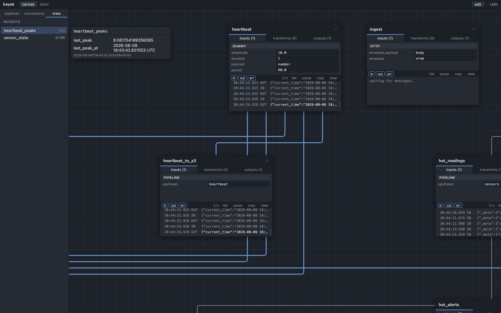

# kayak

**kayak** is a graph-based stream processing engine: you describe pipelines as
`inputs → transforms → outputs`, kayak runs them, and a live web canvas shows
the graph while it's running — cards for every pipeline, edges for how data
flows between them, and a log and throughput chart on each one.



Pipelines are configured, not coded: nats, kafka, mqtt, http and a couple of
dummy inputs; transforms for filtering, reducing/aggregating, reshaping
fields, buffering, splitting and remembering state across messages; outputs to
postgres, ClickHouse, files, S3-compatible object storage, mqtt and stdout. Messages
are plain JSON the whole way through — no schema to define up front. A pipeline can feed
another pipeline, so the graph is a DAG, not just a list of independent jobs.

Everything is driven from one Axum server with a Leptos web UI on top. The
canvas is a real view onto the running server, not a mockup: watching it,
editing the graph from it, and hitting the same JSON/HTTP API by hand are all
the same interface.

## why

Most stream-processing tools are either code (write a consumer, wire it up
yourself) or heavyweight platforms (Flink, Benthos-as-a-service) that hide the
running graph behind logs and dashboards you build separately. kayak is
aimed at the space in between: pipelines you can describe in a config file,
see running as a graph while they run, and reshape from the same screen —
useful for small-to-medium data-wrangling jobs where you want to *see* what's
happening, not just trust that it is.

## getting started

You'll need [Rust](https://rustup.rs), [`just`](https://github.com/casey/just),
and [`cargo-leptos`](https://github.com/leptos-rs/cargo-leptos)
(`cargo install cargo-leptos`). Docker is optional — needed only for the nats,
kafka, mqtt, database and S3 pipelines in the sample graph.

```bash
just dev
```

This builds the frontend, starts the server on `localhost:6767` against the
worked example in `example_config/`, and creates a secrets file for you on
first run. Sign in as `niclas` / `hunter2` (admin) or `viewer` / `hunter2`
(read-only) — the sample runs with authentication on by default, so both
sides of the login are there to look at.

To see every pipeline in the sample actually flowing (nats, kafka, mqtt,
postgres, ClickHouse, S3), bring up the systems it talks to first:

```bash
docker compose up
just dev
```

Without Docker, the sample still runs — the pipelines with nothing to talk
to just show a connection error on their card; the dummy-input pipelines
(`heartbeat`, `ingest`) work regardless.

Once it's up:

- the canvas is at `/` — pan and zoom, click a card to open its log
- the generated component and HTTP API reference is at `/docs`
- `curl -X POST localhost:6767/api/pipelines/ingest/messages -d '{"sensor":"a","value":1}'`
  pushes a message straight into the `ingest` pipeline

### other commands

```bash
just ci                              # lint + test — what CI runs; green before calling anything done
just test                            # offline unit + integration tests, no Docker needed
just build                           # production build — one binary, frontend included
docker run -p 6767:6767 ghcr.io/niclasgrahm/kayak
                                      # the published image; empty graph — mount a config to run your own
docker build -t kayak . && docker run -p 6767:6767 kayak
                                      # or build it yourself
```

## documentation

- **[the docs site](website/)** — the full documentation: how the canvas and
  editor work, the pipeline and metadata model, every transform and output,
  connections, secrets, authentication, deployment and testing, plus a
  generated reference for every component and every endpoint. `just docs-dev`
  serves it on `localhost:5173`.
- **`/docs`** on a running server — generated reference for every component
  and the whole HTTP API (also served as OpenAPI at `/api/openapi.json`).
- **[docs/roadmap.md](docs/roadmap.md)** — what's in flight, planned, or a
  known issue.
- **[CLAUDE.md](CLAUDE.md)** — architecture notes for anyone (human or
  otherwise) working on kayak itself: how the crates fit together and why
  particular things are built the way they are.

## license

kayak is **AGPL-3.0-or-later**, except `kayak-core` — the shared config types
and DTOs — which is **Apache-2.0** so that anything talking to kayak can be
built against it freely.

Self-hosting, modifying, and running kayak inside a company are all what the
licence is for and ask nothing of you beyond keeping the notices. Offering a
*modified* kayak to others over a network is the case the AGPL covers, and a
commercial licence is available for anyone that doesn't suit.

[licensing.md](licensing.md) has the reasoning, the third-party notices and
what a contribution is licensed under.
